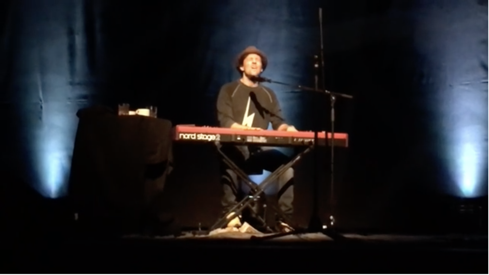

Hello there my demon friend. I noticed you’re still there. I was looking at something else and forgot that you were there. I see you again and I’m scared. Because your eyes are tantalizing, I’d look deep into it. I’d get sucked by analyzing every detail of your scary face. I’d do this for hours at a time, not be able to do anything else. I’d tell you “just go away, you monster!!!”, but you’re still there. I feel powerless. One time I decided just not to look, still knowing you’re beside me. I saw blue skies during the day and a multitude of stars at night. I saw brighter eyes, less complex than yours but nonetheless beautiful. I sometimes still turn around and get tempted to look at you more. Because I thought there’s a part of you I have not seen before. Another angle that I’ve not perused. I then remember that each time I do that, I am left out of breath and scared that I would do nothing else. Or, worse, slowly turn like you, dark, forever sad and angry - a demon. Both dead and alive. We fetishize you as a source of being human, a source of creativity. That’s why some people actually enjoy looking at you despite the pain. But I d o not. I’m sorry my friend, I will sometimes glance at you, say hello. However, there are other interesting things to see in this universe.. you can stay there as long as you want but I won’t feed you anymore attention.   There are other more interesting things, imperfect and complex enough that give me peaceful happiness. More delight than dread. More good than the bad. Just the right level for me. My friends with bright eyes and smiles are waiting…

