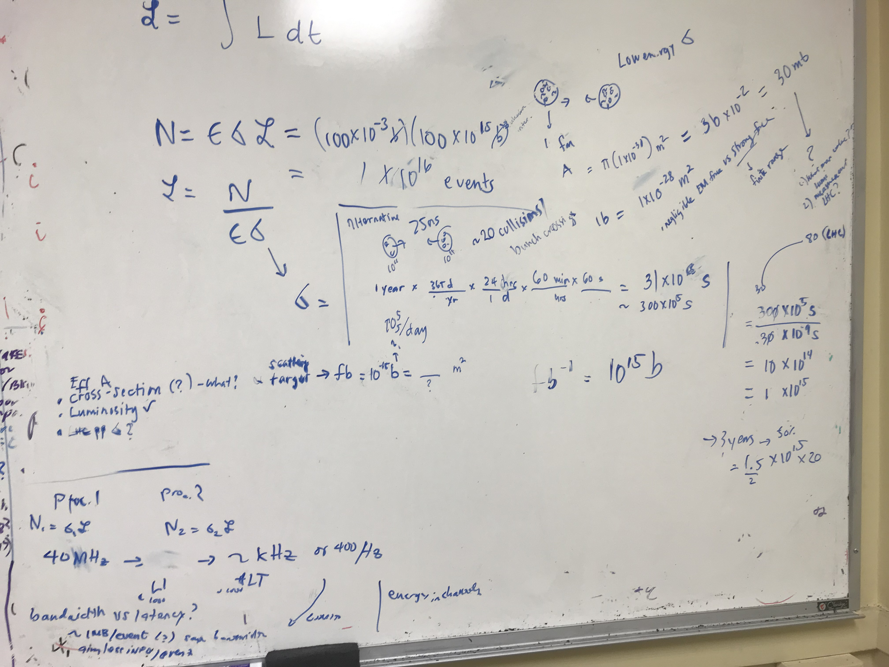

Collider physics papers normally report the amount of data they collected in terms of "Luminosity" $$\mathcal{L}$$. It wasn't very clear to me what it meant so my adviser "friendly grilled" me about it and we went down to the very basics.

One of the first things we think about when it comes to the actual data we collected is the number of events that we can get out proton-proton collisions.

\\[ N = \varepsilon \sigma \mathcal{L} \\]

We can move things around and solve for the Luminosity. But what is the cross-section $$\sigma$$ here and the number of events N? We can assume that the efficiency $$\varepsilon$$ is just 1.
