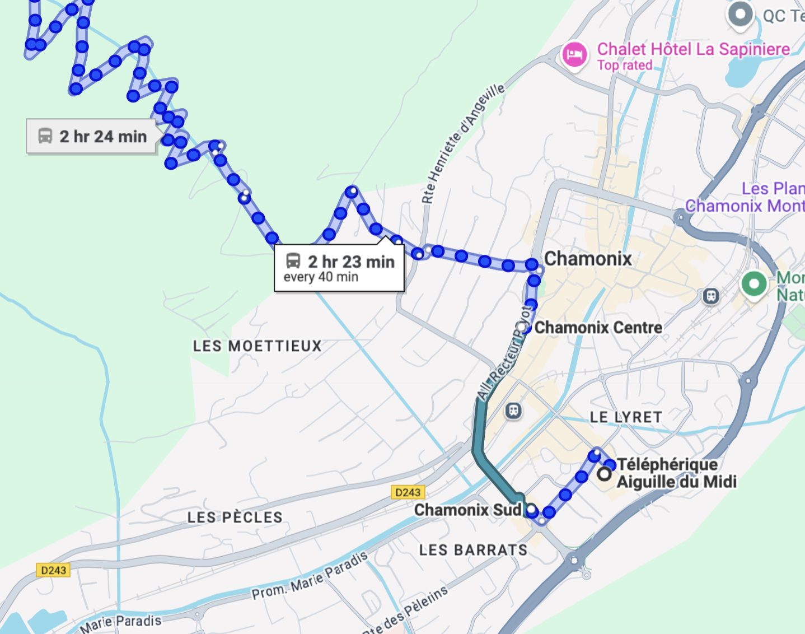

I'm going to word vomit here to practice Spanish (or Spanglish) for my 2nd semester of Spanish. These are the topics: 

* Presente de indicativo 
* Los 3 pasados 
* El gerundio 
* Verbos reflexivos 
* Los Posesivos 

Necesito practicar para esos temas tambien: 
* La familia 
* La descripcion fisica
* La comida 
* La rutina
* La salud 
* El mercado 
* La casa 
* Pedir direcciones 

Ok, I'm going to write some short paragraphs or some sentences following some kind disorganized of stream of consciousness. 

## Mi Rutina Diaria (Cheated with LLama XD)

Mi rutina diaria es la siguiente:
Me levanto alrededor de las 8 am, despues de haber dormido exactamente 12 horas y haber tenido 7 sueños increíbles.
Medito durante al menos 5 minutos, conectando con mi interior y alcanzando un estado de nirvana. Si tengo tiempo, hago algunos estiramientos para mantener mi flexibilidad y evitar convertirme en una estatua de piedra.
Pero si estoy tarde, me lanzo directamente a la ducha, me cepillo los dientes, me peino el cabello, me visto con me traje de superhéroe y salgo de las casa. 
Alrededor de las 8:45-9:15, tomo el autobús y viajo durante 35 minutas, durante los cuales leo un libro entero. Luego, camino hacia la oficina, donde dejo mi bolsa y guardo mi comida en la nevera. 
Me preparo un café y comienzo a trabajar. 
Al mediodia, como con mis colegas y nos reímos de chistes durante exacatamenta 1 hora. En la tarde, tengo algunas reuniones o clases, y el resto del tiempo trabajo hasta las 6 o 7 pm. 
Después del trabajo, si estoy bien, voy al gimnasio a levantar pesas y luego camino hacia mi casa durante 1 hora y 15 minutos, durante los cuales eschucho podcasts y me convierto en un experto en cualquier tema. 
Pero si no estoy bien, tomo el tren y me convierto en un experto en mirar el reloj. Por la noche, medito un rato mas, miro Youtube/Netflix, hago algunos ejercicios en Duolingo para mejorar mi español y me acuesto a dormir, listo para repetir el ciclo al dia siguiente.

## La Salud: Que le duele?
* Ceja - Eyebrow
* Frente - Forehead
* Oido -
* lengua
* Muela -cheek tooth
* Cuello 
* Garganta
* Pecho
* Espalda
* Codo
* Muñeca
* Barriga - Le duele la barriga
* Rodilla - Me duele la rodillas
* Tobillo

Some useful phrases:
* Tiene tos.
* Tiene fievre.
* Creo que tiene grippe.
Que le duele?
TODO MI CUERPO. XD

## Pedir Dirreciones
Map of my favorite place in the world.

Aquí tienes un mapa detallado para ir caminando desde el Teleférico de Aiguille du Midi hasta el Teleférico de Brévent en Chamonix, Francia:

Los intrucciones detalladas para ir caminando, aproximadamente 15-20 minutos a pie:
Primero: Salida desde el Teleferico de Aiguille du Midi - Ubicado en la intersección de la Avenue de l'Aiguille du Midi y la Rue du Lyret.
Camina hacia el norte por la Rue du Lyret hasta llegar a la Rue Joseph Vallot.
Gira a la izquierda en la Rue Joseph Vallot y continua recto.
Cruza el puente sobre el rio Arve y sigue por la Allée Recteur Payot.
Gira a la izquierda en la Rue Whymper, que se convierte en la Allée du Recteur Payot.
Sigue las señales hacia el Télépherique de Brévent, subiendo ligeramente por el camino señalizado hasta la estación base del teleférico.

## Descripción física – Crushes edition

Guess who? Have had different crushes (and nice exes) in the last 5 years.

Hay chicas que son altas.
También hay mujeres bajitas o de estatura media.
Normalmente, soy más musculoso que ellas.
Todas tienen sonrisas bonitas, especialmente cuando sus ojos expresan felicidad.
He salido con una rubia, una morena, una de pelo oscuro y una pelirroja.
Me gustan los ojos grandes o pequeños.
Pero lo más importante es una conexión intelectual y emocional.
No estoy buscando activamente. Solo vivo mi vida con intención, y si se cruza alguien con quien todo encaja... entonces bienvenido sea.
Sería bonito encontrar a alguien con quien tenga una vida compatible, que compartamos valores fundamentales. Me atraen las personas con carácter profundo, integridad y un gran sentido del humor.

